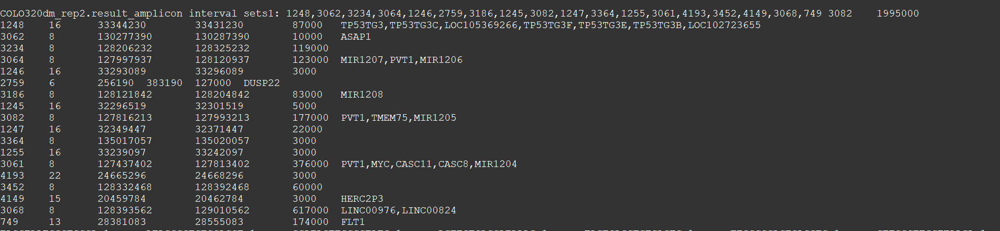
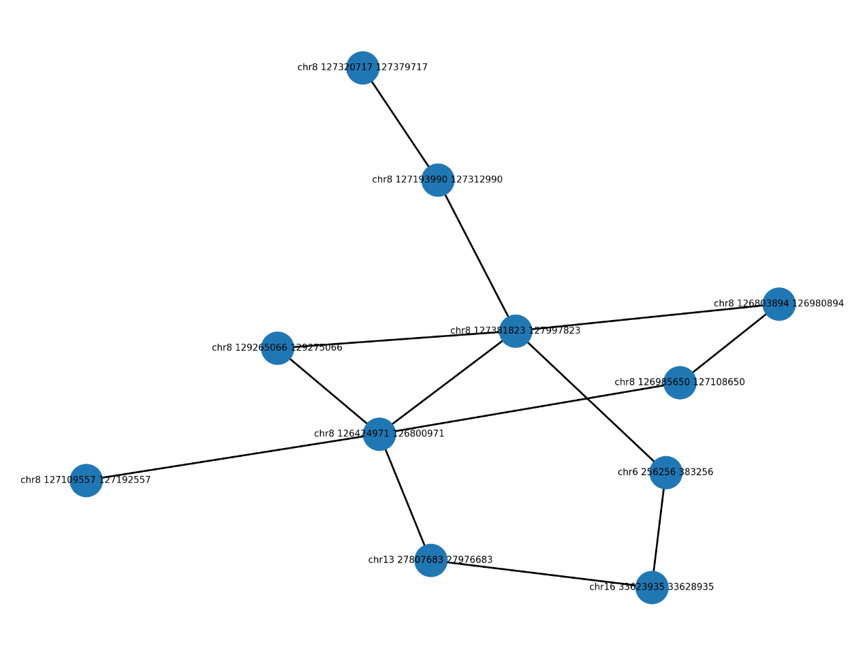
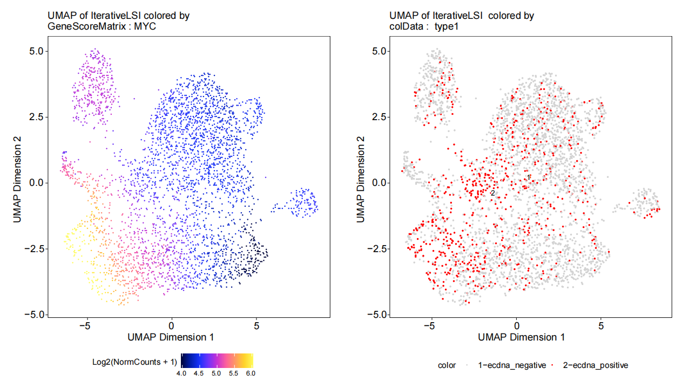

# ATACAmp
Searching for  co-amplified regions on the genome from ATAC-seq data
## Table of Contents
* Backgroud
* Install
* Usage
* Example
* Output
* License
## Backgroud
High expression of oncogenes in cancer cells is an important cause of rapid tumor progression and drug resistance. Recent tumor genome research reveals that oncogenes and regulatory elements can be amplified as extrachromosomal DNA (ecDNA) or subsequently integrated into chromosomes as homogeneous staining regions (HSRs). These genome-level variants lead to over-expression of corresponding oncogenes, resulting in poor prognosis. Most existing methods detects ecDNA by utilizing whole genome sequencing data. They usually detect many false positive regions, due to the interference of chromosomal DNA.Here, we describe an algorithm called ‘ATACAmp’ that can find out ecDNA/HSR in tumor genomes by utilizing ATAC-seq data. High chromatin accessibility is one of the characteristics of ecDNA, which makes ATAC-seq naturally enriched ecDNA and reduces the interference of chromosomal DNA. We validated the algorithm using ATAC-seq data from three cell lines that have experimentally determined ecDNA regions. ATACAmp successfully identified the majority of validated ecDNA regions. We also used AmpliconArchitect, the widely used ecDNA detecting tool, to detect ecDNA regions based on WGS data of the same cell line. Results shows that ATACAmp exhibited higher accuracy than AmpliconArchitect. In addition, ATACAmp also support the analysis of single-cell ATAC-seq data, which links ecDNA to a specific cell. This can facilitate the study of ecDNA at single cell level.
## Install
### Github source code:
git clone https://github.com/chsmiss/ATAC-amp.git
## Usage
usage: AtacAmp.py [-h] [--bam BAM] [--name NAME] [--isize_value ISIZE]
                  [--interval_size INTERVAL] [--mapq MAQP] [--mode {0,1,2}]
                  [--discbk DISCBK] [--type LIB] [--gtf GTF]
                  [--threads THREADS]

optional arguments:
  -h, --help            show this help message and exit  
  --bam BAM             input the bam file  
  --name NAME, -n NAME  prefix of output files  
  --isize_value ISIZE, -i ISIZE  
                        judge a pair of reads whether is discordant  
  --interval_size INTERVAL, -s INTERVAL  
                        size of interval when compute breakpoint nearby coverage  
  --mapq MAQP, -q MAQP  
  reads maqp threshold  
  --mode {0,1,2}, -m {0,1,2}  
                        choose the analysis mode,0/1/2  
  --discbk DISCBK, -d DISCBK  
                        if you choose mode 1,you need to input discbk file  
  --type LIB          
  choose library:sc/bulk  
  --gtf GTF             gtf file  
  --threads THREADS     threads  

## Example
python ../../../10.other/AtacAmp/AtacAmp.py --bam ../../10.atac_seq_data/SRR8236755.q20.sorted.bam -i 1000 -s 1000 --gtf ../../../01.human_reference/hg38.refGene.gtf --threads 12 -n GBM39_1 -m 0 --type bulk
## Output
### example output(.result)

### example output figure(png format):The links of  highest scoring co-amplified regions in the colo320DM cell line.

### MYC expression heterogeneity in the colo320dm cell line

## License
