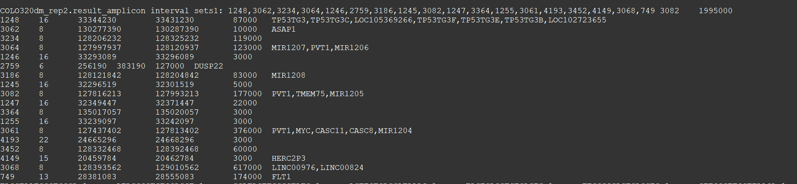
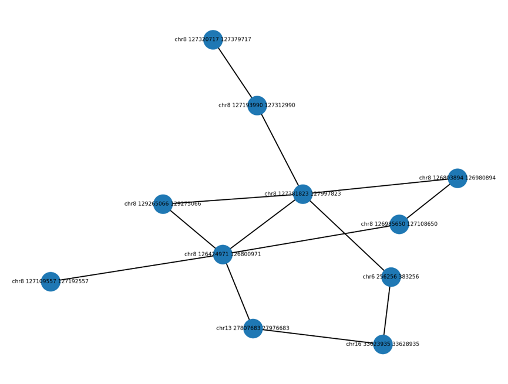
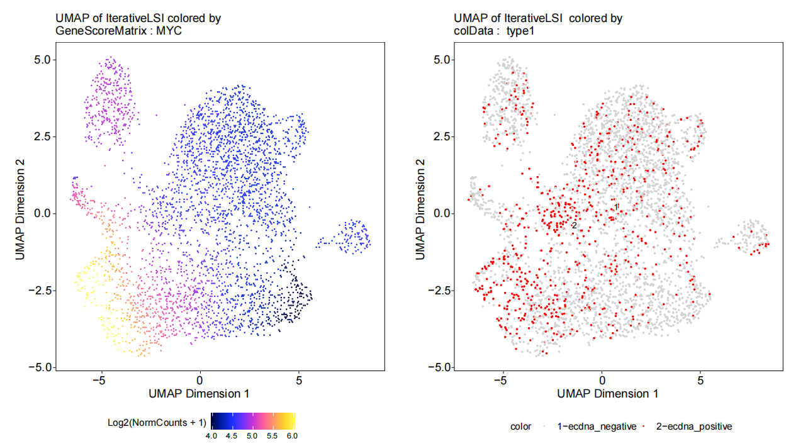

# ATACAmp

[](LICENSE)
[](https://www.python.org/)

ATACAmp detects co-amplified genomic regions—candidate extrachromosomal DNA
(ecDNA) or homogeneously staining regions (HSRs)—from bulk or single-cell
ATAC-seq data.

## Overview

Oncogenes and regulatory elements can be amplified as ecDNA or reintegrated
into chromosomes as HSRs. Because ecDNA often has highly accessible chromatin,
ATAC-seq can enrich these sequences while reducing interference from ordinary
chromosomal DNA. ATACAmp combines coverage and breakpoint evidence to identify
candidate amplified regions and connects those regions into graphs.

> ATACAmp reports candidate ecDNA/HSR regions. Its output should be interpreted
> with appropriate controls and, where possible, orthogonal validation.

## Contents

- [Requirements](#requirements)
- [Installation](#installation)
- [Input](#input)
- [Usage](#usage)
- [Outputs](#outputs)
- [Repository layout](#repository-layout)
- [Citation](#citation)

## Requirements

- Python 3.7 or later
- [samtools](https://www.htslib.org/) available on `PATH`
- A coordinate-sorted BAM file and its index
- A GTF annotation whose chromosome naming convention matches the BAM

Python dependencies are listed in [`requirements.txt`](requirements.txt).

## Installation

```bash
# Clone the repository
git clone https://github.com/chsmiss/ATAC-amp.git
cd ATAC-amp

# Create an isolated environment (recommended)
conda create -n atacamp python=3.9 samtools -c conda-forge -c bioconda
conda activate atacamp

# Install Python dependencies
python -m pip install -r requirements.txt
```

Confirm that the command-line interface is available:

```bash
python AtacAmp.py --help
```

## Input

| Input | Description |
| --- | --- |
| BAM | Coordinate-sorted bulk or single-cell ATAC-seq alignments. Single-cell reads must carry `CB` tags. |
| BAM index | The corresponding `.bai` file. |
| GTF | Gene annotation containing `transcript` records. |
| Breakpoint file | Required only with `--mode 1`; this reuses previously detected discordant breakpoints. |

## Usage

```text
python AtacAmp.py --bam INPUT.bam --gtf ANNOTATION.gtf \
  --type {bulk,sc} --mode {0,1} [options]
```

### Options

| Option | Default | Description |
| --- | ---: | --- |
| `--bam` | required | Input SAM/BAM file. |
| `--gtf` | required | Gene annotation in GTF format. |
| `--type {bulk,sc}` | required | Library type. |
| `--mode {0,1}` | required | `0`: detect breakpoints from the BAM; `1`: reuse `--discbk`. |
| `--discbk`, `-d` | — | Discordant-breakpoint file; required in mode 1. |
| `--name`, `-n` | BAM basename | Output prefix. |
| `--isize_value`, `-i` | `1000` | Insert-size threshold for discordant read pairs. |
| `--interval_size`, `-s` | `1000` | Window size used for breakpoint-nearby coverage. |
| `--mapq`, `-q` | `0` | Minimum read mapping quality. |
| `--threads` | `1` | Worker process count. |

### Bulk ATAC-seq example

```bash
python AtacAmp.py \
  --bam /path/to/sample.sorted.bam \
  --gtf /path/to/hg38.annotation.gtf \
  --type bulk \
  --mode 0 \
  --name sample \
  --isize_value 1000 \
  --interval_size 1000 \
  --mapq 20 \
  --threads 12
```

### Single-cell ATAC-seq example

Use the same command with `--type sc`. Reads must contain cell barcode (`CB`)
tags. A representative result file is available at
[`examples/Example_scATAC.result`](examples/Example_scATAC.result).

### Reusing breakpoint calls

```bash
python AtacAmp.py \
  --bam /path/to/sample.sorted.bam \
  --gtf /path/to/hg38.annotation.gtf \
  --type bulk \
  --mode 1 \
  --discbk sample.discordant.disc_bk \
  --name sample_rerun
```

Run ATACAmp from the repository root because the entry-point coordinates the
internal analysis scripts. Output files are written to the current directory.

## Outputs

ATACAmp creates intermediate BAM, breakpoint, interval, and amplicon files in
addition to the final `<name>.result` report. The final report describes linked,
co-amplified regions and their annotations.

### Example report



### Example co-amplification graph

The graph below shows links among the highest-scoring co-amplified regions in
the COLO320-DM cell line.



### Single-cell expression heterogeneity



## Repository layout

```text
ATAC-amp/
├── AtacAmp.py            # Command-line entry point
├── atacamp/              # Coverage, breakpoint, and graph modules
├── docs/images/          # README figures
├── examples/             # Example result files
├── tests/                # Automated tests
├── requirements.txt      # Python dependencies
└── LICENSE
```

## Testing

The coverage-window tests do not require native bioinformatics dependencies:

```bash
python -m unittest discover -s tests -v
```

## License

ATACAmp is distributed under the [MIT License](LICENSE).

## Citation

If you use ATACAmp, please cite:

> Cheng, H., Ma, W., Wang, K. et al. ATACAmp: a tool for detecting ecDNA/HSRs
> from bulk and single-cell ATAC-seq data. *BMC Genomics* **24**, 678 (2023).
> <https://doi.org/10.1186/s12864-023-09792-6>
